# CSV Web Application
A Full Stack Web Application that handles CSV data

## Technology
### Frontend
- React - Frontend View Framework.
- React Virtualized - Frontend library to render large lists and tabular data.
- Axios - Frontend Interface With a Backend REST API.
- BootStrap - Styling Pages.

### Backend
- Flask-Restful - Object-Oriented Programming(OOP) Backend REST API.
- Flask-SQLAlchemy - Object-Relational Mappers(ORM), high-level abstraction that transfer database data into objects.
- SQLite or PostgreSQL - Setup to work with the Relational Database SQLite or PostgreSQL.  


# Requirements
The application have the ability to:
- [x] Upload a CSV file 
- [x] List uploaded CSV files  
- [x] Download the previously uploaded CSV file 
- [x] Display the CSV content showing at least all column headers and content
- [x] Provide statistics on the number of people with the same year in the “date” field.

### Upload a CSV file  
To upload a csv file go to csvWeb tab and click on choose File then Upload button

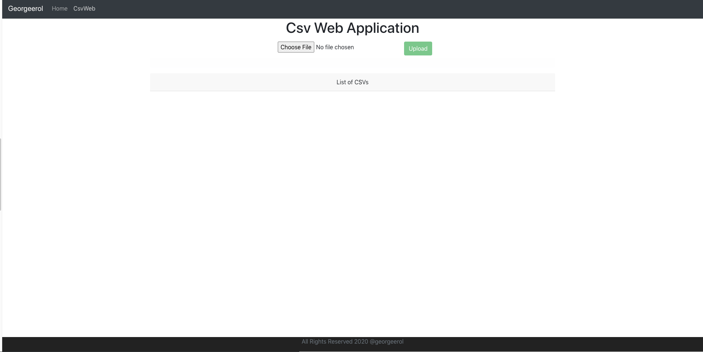

---
**NOTE**

*When uploading a big csv file wait until the message says Upload {yourFilename} Successfully*

---


### List uploaded CSV files
After a file is uploaded, a list of uploaded csv files is shown below the List of CSVs
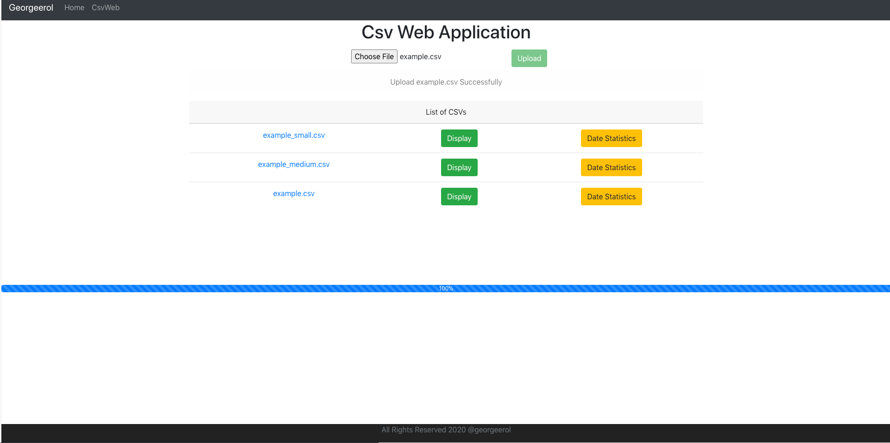

### Download the previously uploaded CSV file 
To download any csv files click on the filename
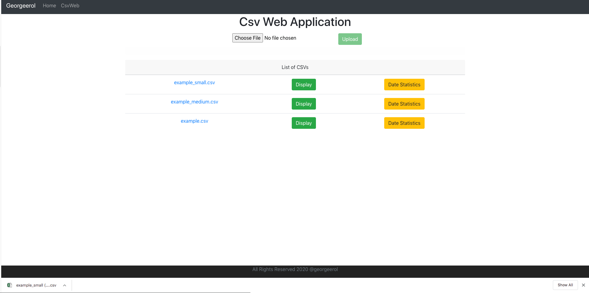

---
**NOTE**

*When downloading a big csv file, wait a few seconds. The file takes sometime to be prepared.*

---


### Display the CSV content showing at least all column headers and content
To display a csv content click on the Display button. Scroll down to see the rest of the file
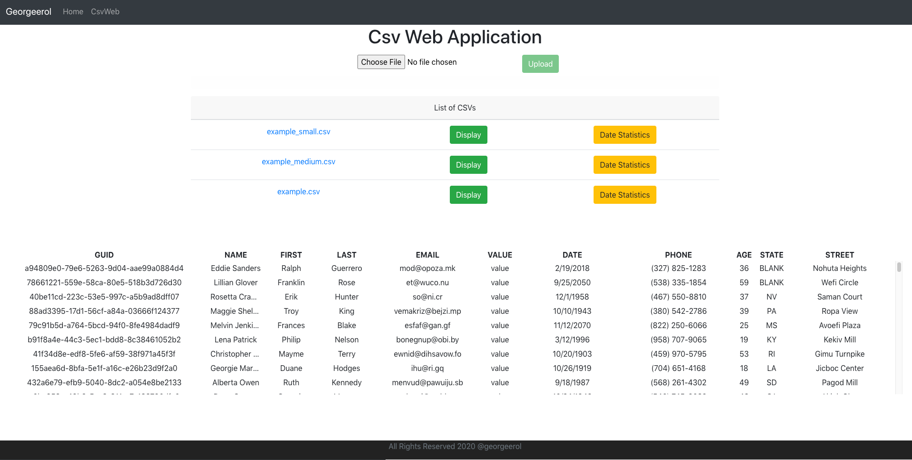

---
**NOTE**

*When displaying a big csv file, wait a few seconds. The file takes sometime to render on the page.*

---

### Provide statistics on the number of people with the same year in the “date” field.
To display the stats on the number of people with the same year click on the Date Statistics button. 
Scroll down to see the rest of the file.
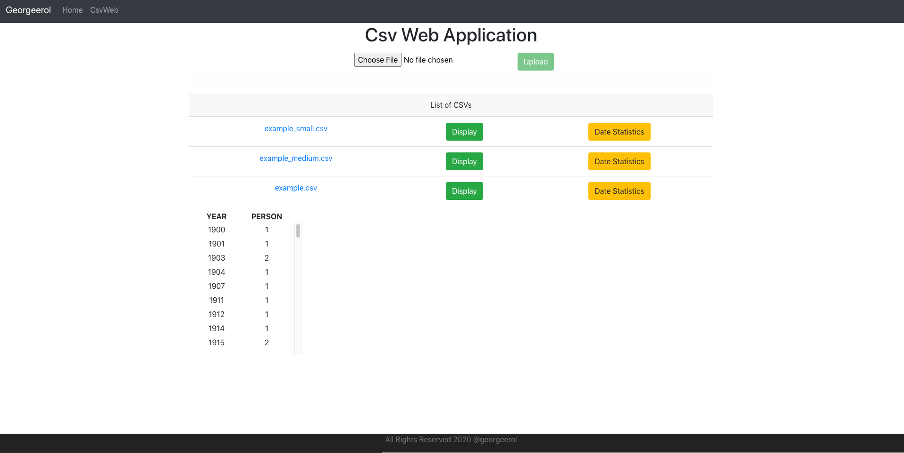


# CsvWepApp Backend
## Backend Development Structure
##### The organization of the project's folders and files is shown below:

```sh
src
├── app.py
├── config
│   └── config.yaml
├── dev
│   ├── db
│   │   └── db.py
│   ├── env
│   │   ├── base_env.py
│   │   ├── dev_postgres_db.py
│   │   └── dev_sqllite_db.py
│   ├── mgr
│   │   ├── display_mgr.py
│   │   ├── download_mgr.py
│   │   ├── get_files_mgr.py
│   │   ├── stats_manager.py
│   │   └── upload_mgr.py
│   ├── model
│   │   └── csv_web_model.py
│   ├── service
│   │   └── csv_web_service.py
│   ├── setup
│   │   └── app_setup.py
│   └── util
│       ├── helper
│       │   └── get_config.py
│       ├── logger
│       │   └── logger.py
│       └── yaml
│           └── yaml.py
├── temp
│   └── test.csv
```

- `app.py` : This file initializes and configure the Flask application and set up all API services. It is the entry point to the CsvWebApp
- `config.config.yaml` : This file contains various requirement which are defined in the `config.yaml`. These include:
    - App Release Version
    - App URI Path
    - Temp Download Folder
    - Logging information
- `dev.db.db.py`:  This file creates this project database python object, so that other files can import it. All other files import the database variable from it.
            The reason for creating a separate file containing just this is precisely so it's easier to import and to avoid python's circular imports.
- `dev.env`: This folder contains all the environment needed to run the CsvWebApp based on the `.env` file. The behavior template method pattern is used to choose different environment 
             such as running the app with a sqlite database(included in this project) or postgres(needs to be install separately)

- `dev.mgr`: This folder contains all the business logic of each services and act as the middleman for the models(`dev.model.csv_web_model`) and services(`dev.service.csv_web_service`)

- `dev.model.csv_web_model`: This file contains definition of what data our application deals with, and ways to interact with that data. 
                             It contains the `CsvWebAppFileModel` and  CsvWebAppCsvModel classes. 
                             A one-to-many relationship where a file(`csv_web_app_file` table) is associate with one or more csv data(`csv_web_app_csv` table).
- `dev.service.csv_web_service` : This file defines how clients interact with the CsvWebAPP REST API. 
                                  It defines the endpoints where clients send requests, such as upload, download, display, get stats and get files. 
- `setup.app_setup.py`: This file setup config information base on the `config/config.yaml`.
- `dev.util`: This folder contains all the utilities that the CsvWebAbb needs to run.
- `dev.temp`: This folder contains all the prepare file that are set to be downloaded from the Download Service.
## Backend Class  Diagram
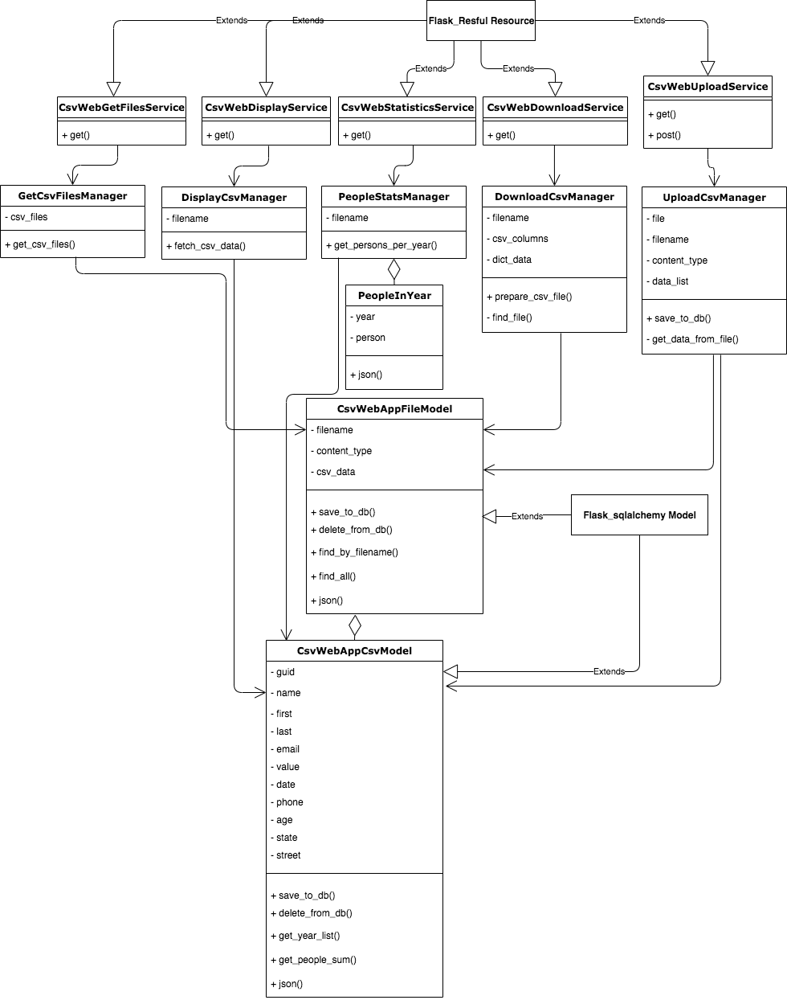

## Backend Test Structure
Tests are setup as system, integration and unit test.

```sh
test
├── base_test.py
├── integration
│   └── mgr
│       ├── display_mgr_test.py
│       ├── download_mgr_test.py
│       ├── get_files_mgr_test.py
│       ├── stats_mgr_test.py
│       └── upload_mgr_test.py
├── system
│   └── service
│       ├── csv_web_display_service_test.py
│       ├── csv_web_get_files_service_test.py
│       ├── csv_web_stats_service_test.py
│       └── csv_web_upload_service_test.py
├── test.sh
├── test_suite.py
└── unit
    └── util
        └── yaml_test.py

```

- `base_test`: this file is  the parent class to each non-unit tests. It allows for instantiation of the database  dynamically and makes
   sure that it is a new, blank database each time.
- `test.sh` : Run this script to run all tests.
- `test_suite`: This file contains all the tests as list and run all of them.

# Front End Development Structure
```sh
frontend
├── package.json
└── src
    ├── App.js
    ├── Constants.js
    ├── components
    │   └── csvweb
    │       ├── CsvWebApp.jsx
    │       ├── CsvWebComponent.jsx
    │       ├── FooterComponent.jsx
    │       └── HeaderComponent.jsx
    ├── index.css
    ├── index.js
    ├── service
    │   └── CsvWebService.js
```
- `src.App.js` : This file is the container that embed all React components
- `src.Constants.js`: This file contains the constant the constant HTTP base Url
- `src.components.csvweb.CsvWebComponent.jsx`: This file contains the upload form, progress bar, display of list csv files with download url, 
                                               display csv button and display stats button
- `src.components.csvweb.CsvWebApp.jsx` : This file brings all the App components `HeaderComponent`, `FooterComponent` and `CsvWebComponent` together. 
                                         
- `src.service.CsvWebService.js`: This file provides the methods to upload, download, display, get stats and get csv files using Axios.                                    

# Testing
To run the testing script, run the command below in the terminal. 
``` sh
$ cd src
$ chmod 777 ./test/test.sh
$ ./test/test.sh
```
The ./test.sh will run the `test_suite.py` which contains unit, integration and system tests. The results of these tests are reported in the Terminal.

# Code Coverage Testing
You can test to see how much of the CsvWebApp code is run via `test_suite.py` by generating a coverage report.
First, install coverage in Terminal using
``` sh
$ pip install coverage
```
Next, run the following commands:
``` sh
$ coverage run test/test_suite.py
$ coverage report
$ coverage html
```
`coverage run test/test_suite.py` will run all tests with `coverage`.

`coverage report` will print a coverage report in Terminal.

`coverage html` will create an interactive html file that you can open in a web browser. This html file is stored
in the path `src/htmlcov/index.html`. Find this in your file explorer and double-click it to open it in your 
default browser. You can use this file to see exactly which lines of code have been run, and which have not.
### Coverage Report
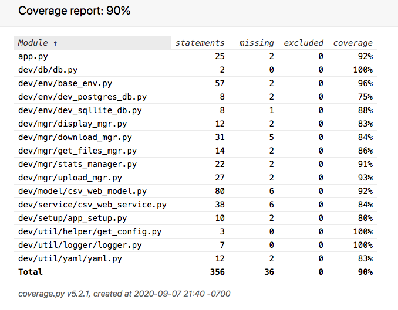
# Running the APP via the terminal

### Backend
To run the backend(Python 3.6 or higher), in the main directory run these command below in a terminal.
```sh
$ pip install -r requirements.txt
$ cd src
$ chmod 777 run.sh
$ ./run.sh
```
The ./run.sh will run the app.py with the information provided in `.env` . A sqlite db will be automatically created as soon as the backend
receive a request. 

### Frontend
To run the frontend, open a new terminal, in the frontend directory, run these commands below in a terminal:
```sh
$ cd frontend
$ npm install
$ npm start
```
*Note*: Make sure you have node.js installed to run npm 

# Running the Backend via Pycharm
Open the app via Pycharm and set the project interpreter and structure located under Pycharm -> Preferences
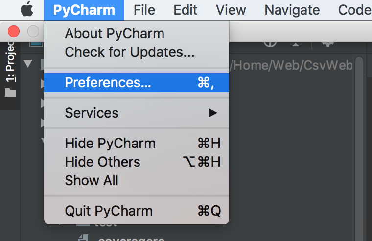
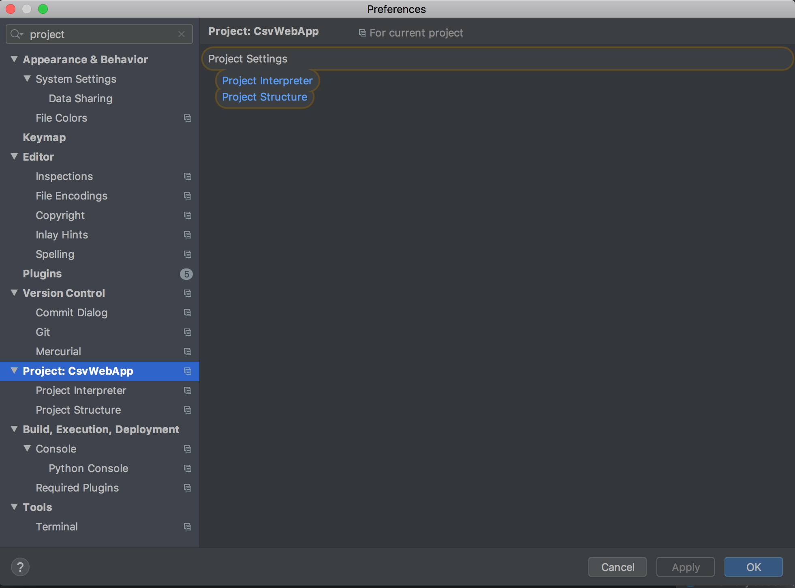

#### Set the project interpreter to a python 3.6 or higher.
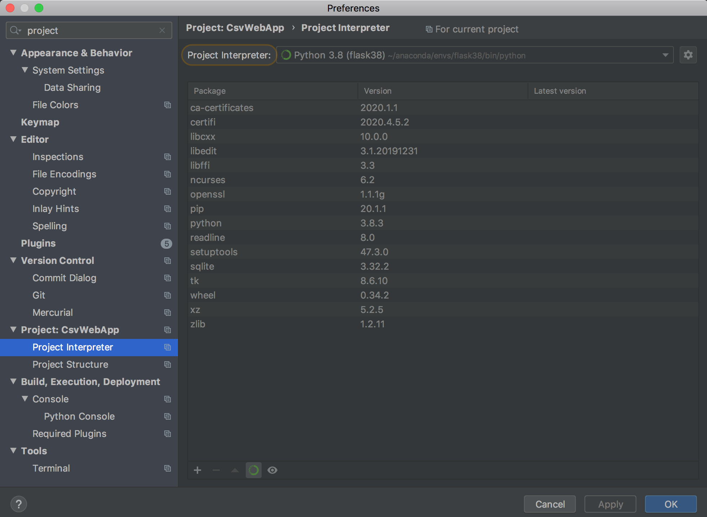

### Set the src as the source folder. This will set the `PYTHONPATH` as src.
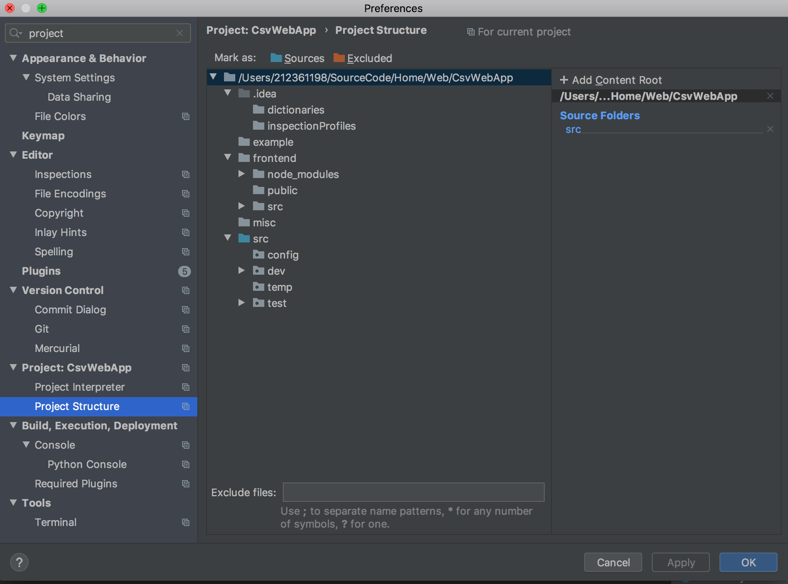

### Run the app.py by clicking on the run button(line 33) and then `Edit Configuration` with the information below
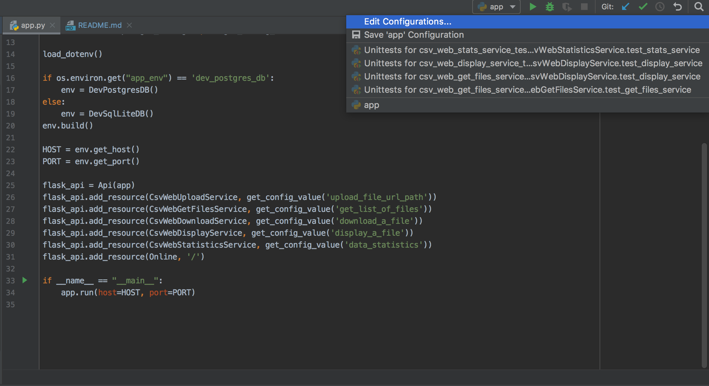
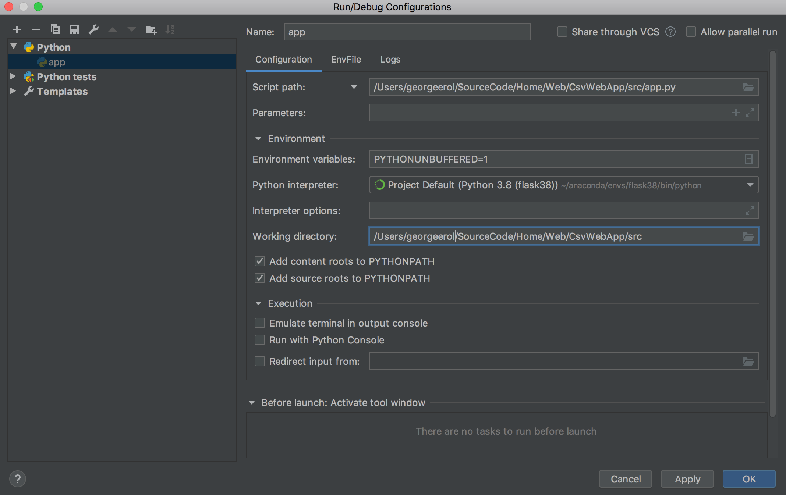

# Future Work
* Add more unit, integration and system tests.
* Fix footer when big data is displayed.
* Frontend to accept negative request from backend.
* Setup DevOps with Travis.
* Data Validation
* Use temp folder as a cache system for the download service

# Similar projects
* ProjectManagementApp
    * Backend: Spring Boot
    * Frontend: Thymeleaf
    * github: https://github.com/georgeerol/ProjectManagementApp
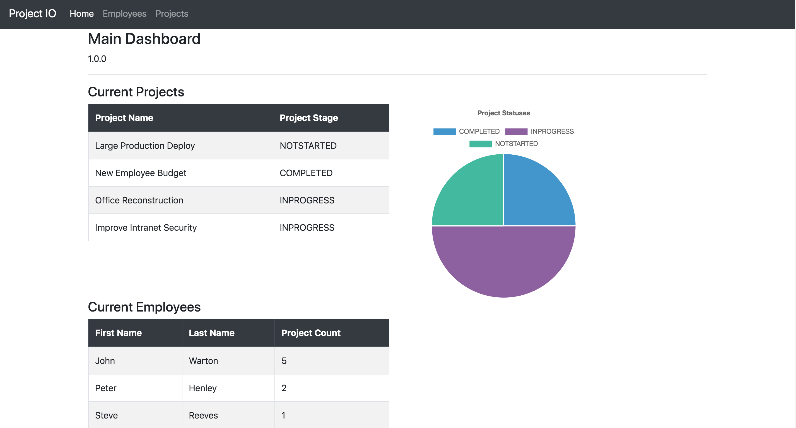    
* TodoApp
    * Backend: Spring Boot
    * Frontend: React
    * github: https://github.com/georgeerol/ToDoApp
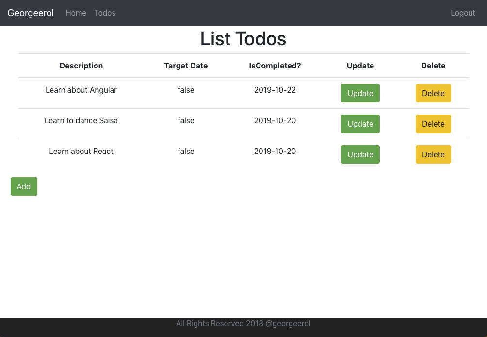


